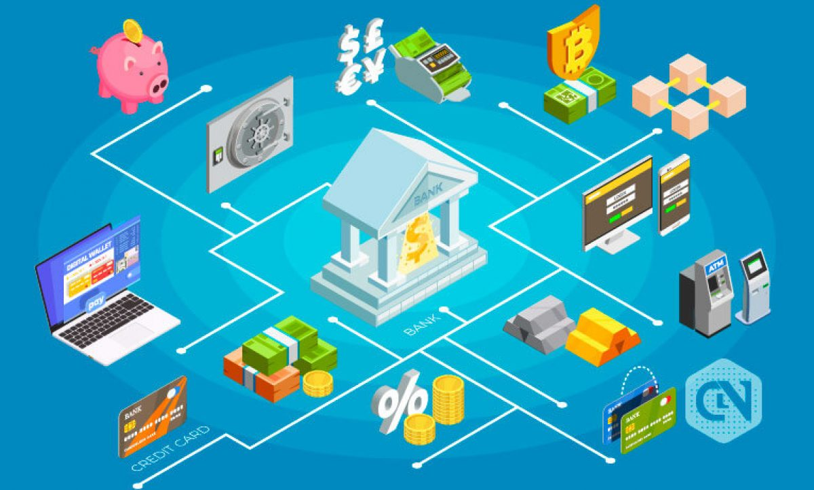
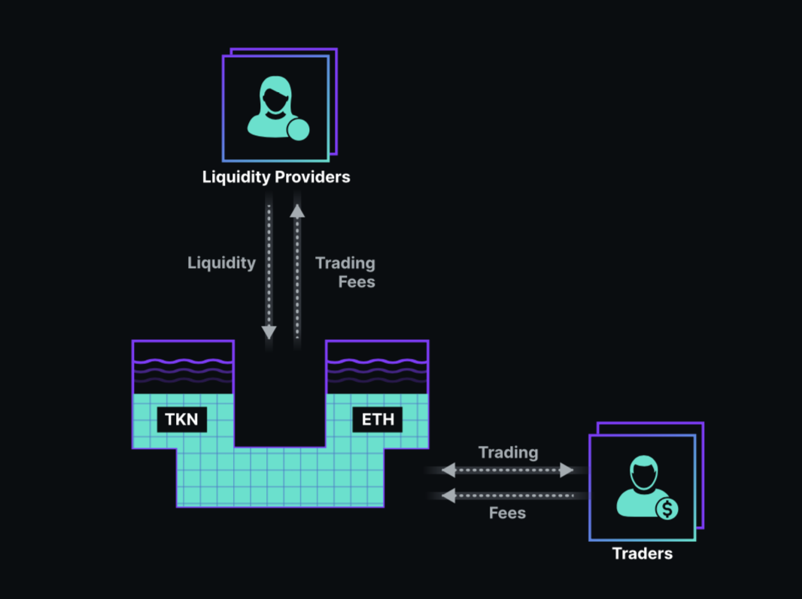
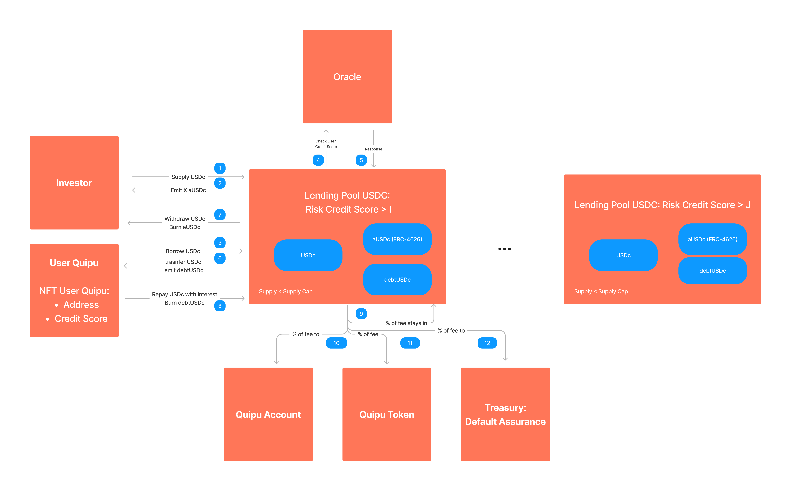
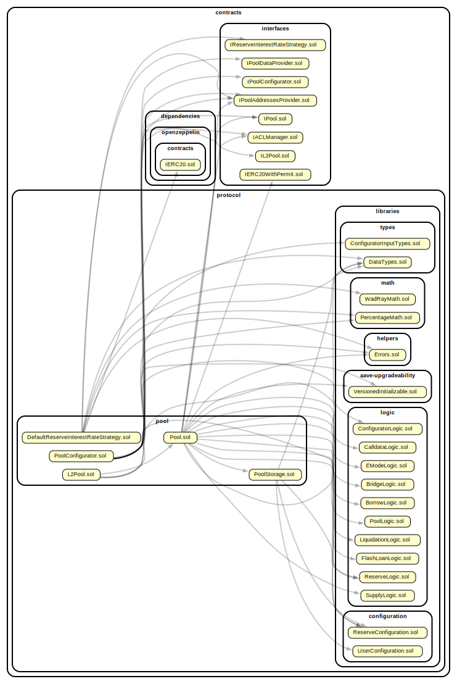
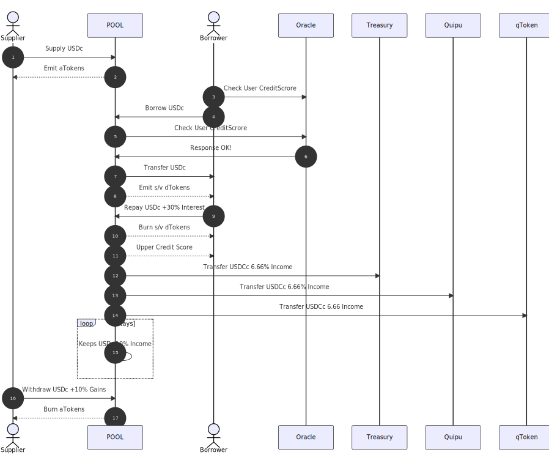

<!--
<link rel="icon" href="https://quipubank.com/wp-content/uploads/2022/10/logo-back.svg" sizes="32x32" />
<link rel="icon" href="https://quipubank.com/wp-content/uploads/2022/10/logo-back.svg" sizes="192x192" />
-->

<style>
@import url(https://fonts.googleapis.com/css?family=Poppins);
@import url(https://fonts.googleapis.com/css?family=Lato);
@import url(https://fonts.googleapis.com/css?family=Montserrat);
@import url('https://fonts.googleapis.com/css2?family=Poppins:wght@600;700;900&display=swap');

:root {
    font-family: "Poppins";
    font-weight: "900";
    --color-background: #ddd;
    --color-background-code: #ccc;
    --color-background-paginate: rgba(
        128, 128, 128, 0.05
    );
    --color-foreground: #383A39;
    --color-highlight: #fff;
    --color-highlight-hover: #54be8f;
    --color-highlight-heading: #99c;
    --color-header: #bbb;
    --color-header-shadow: transparent;
    img[alt~="center"] {
        display: block;
        margin: 0 auto;
    }

}

H2,h2{ font-weight: 700 }
H3,H4,H5{ font-family: "Montserrat" }
h3,h4,h5{ font-family: "Montserrat" }
H6,h6{ font-family: "Lato";     font-weight: 500;}
p,ol,ul,li{ font-family: "Lato"; font-weight: 500; }
section::after {
  content: attr(data-marpit-pagination) '/' attr(data-marpit-pagination-total);
}
</style>


# Blockchain, Web3 y DeFi
<br>

# QuipuBank

---
# Blockchain, Web3 y DeFi

- **Finanzas Decentralizadas:** DeFi, Automated Market Makers (Liquidity Pools),  Lending Pools y Quipu.

---

# DeFi: Finanzas Decentralizadas

Principales arquetipos:
- Creadores Automáticos de Mercado (AMM / Liquidty Pools).
- Pools de Préstamos (Lending Pools) 

<!--
---
## DeFi / Tokens 
-->

---

**DeFi / Automated Market Makers (AMM)**
- Permiten a intercambiar unidades de diferentes tipos de criptoactivos.
- Sin necesidad de encontrar una contraparte.

---

**DeFi / Lending Pools**
- Permiten a usuarios que no son de confianza mutua:
  **Prestar y tomar prestados**
  Criptoactivos.
- Con o sin colaterales.

<!--
Los pools de préstamos son apps descentralizadas que
- Permiten a usuarios que no son de confianza mutua:
  - Prestar criptoactivos.
  - Tomar prestados criptoactivos.
-->


---
<style scoped>
h3, p{
margin-top:-50px;
}

</style>

### Quipu /<br>Lending Pool 
<!--
Acceder a lineas de credito sin establecer un elemento de valor como garantía es que el puede confiscar
al prestatario si éste no devuelve el préstamo según las condiciones acordadas.

Un ejemplo común es cuando se contrata una hipoteca.
Normalmente, el banco le
pedirá que aporte su casa como garantía. 
-->

---

## Quipu / Lending Pool / Protocolo de Smart Contracs 
Sistema de Contratos que gestiona:
- Flujo crédito que proviene de cualquier persona del mundo.
- Fondo de liquidez de donde extraer activos.

<!---
de forma rápida y a tipos de interés asequibles
1. Quipu planea que los
microcréditos provengan de cualquier persona del mundo,
creando un nuevo fondo de liquidez del que se puede extraer.
de forma rápida y a tipos de interés asequibles;

Y aquí es donde entran los tokens.
Los prestamistas compran un token, que está vinculado al peso colombiano para que los microempresarios
puedan obtener dinero real de forma rápida y a tipos de interés asequibles;
y a cambio los inversores reciben un token que genera intereses y
que aumenta su valor a medida que se devuelven los préstamos. 

2. Los préstamos se asignan desde el fondo común a los usuarios de Quipu incluidos en la lista blanca,
basándose en la puntuación crediticia de Quipu.
Quipu construye una puntuación crediticia de IA utilizando información del comportamiento digital de los usuarios en la app,
ventas, puntuación de los clientes, sociodemográfica, etc.

3. Los microempresarios son recompensados con tokens cuando devuelven sus préstamos a tiempo, traen más prestatarios a la comunida
 tienen un catálogo actualizado, etc. Con esos tokens
pueden comprar productos a otros comerciantes de la plataforma, devolver sus préstamos,
ahorrar o incluso realizar inversiones en otros emprendedores de la plataforma Quipu. 
l objetivo final es que estos poseedores de tokens se conviertan en
una herramienta de gobernanza descentralizada en el futuro.
Los emprendedores de Quipu que posean tokens de gobernanza ganarán poder de decisión sobre el protocolo de préstamos.

4. Los prestatarios recibirán su dinero en una tarjeta de prepago que podrán utilizar
para gastar en determinados negocios, mientras reciben tokens quipu como devolución de dinero.
No necesitarán cambiar cripto por moneda fiduciaria.
-->

---

### Quipu / Lending Pool / Secuencias
- Supply
- Borrow
- Repay
- Withdraw
---

### Quipu / Lending Pool / Default 
- Supply
- Borrow
- Default 
- Withdraw

---
<style scoped>
code {
  background: transparent;
  color: #000;
  font-weight: bold;
  min-width: 80%;
}
</style>

# ¡Muchas Gracias!

```
                        ________  ___  ___  ___  ________  ___  ___     
                       |\   __  \|\  \|\  \|\  \|\   __  \|\  \|\  \    
                       \ \  \|\  \ \  \\\  \ \  \ \  \|\  \ \  \\\  \   
                        \ \  \\\  \ \  \\\  \ \  \ \   ____\ \  \\\  \  
                         \ \  \\\  \ \  \\\  \ \  \ \  \___|\ \  \\\  \ 
                          \ \_____  \ \_______\ \__\ \__\    \ \_______\
                           \|___| \__\|_______|\|__|\|__|     \|_______|
                                 \|__|                                  
                        ________  ________  ________   ___  __       
                       |\   __  \|\   __  \|\   ___  \|\  \|\  \     
                       \ \  \|\ /\ \  \|\  \ \  \\ \  \ \  \/  /|_   
                        \ \   __  \ \   __  \ \  \\ \  \ \   ___  \  
                         \ \  \|\  \ \  \ \  \ \  \\ \  \ \  \\ \  \ 
                          \ \_______\ \__\ \__\ \__\\ \__\ \__\\ \__\
                           \|_______|\|__|\|__|\|__| \|__|\|__| \|__|
```
## ¿Preguntas?

---
# Referencias

http://blockchain.mit.edu/how-blockchain-works
https://www.cbsnews.com/news/web3-cryptocurrency-nft-tim-oreilly/
https://es.wikipedia.org/wiki/Cadena_de_bloques
https://chain.link/education/smart-contracts
https://www.coinbureau.com/review/the-graph-grt/
https://clarusway.com/what-is-a-web3-wallet
https://medium.com/coinmonks/the-current-state-of-undercollateralized-defi-lending-2021-1f84e14527b5
https://www.bloomberg.com/features/2022-the-crypto-story/


