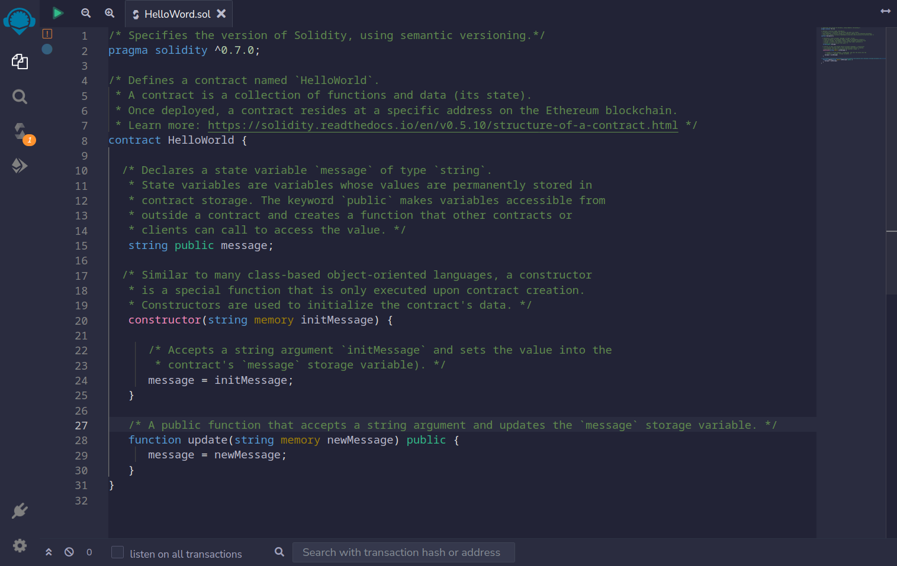

<!--
<link rel="icon" href="https://quipubank.com/wp-content/uploads/2022/10/logo-back.svg" sizes="32x32" />
<link rel="icon" href="https://quipubank.com/wp-content/uploads/2022/10/logo-back.svg" sizes="192x192" />
-->

<style>
@import url(https://fonts.googleapis.com/css?family=Google+Sans);

:root {
    font-family: "Google Sans";
    --color-background: #ddd;
    --color-background-code: #ccc;
    --color-background-paginate: rgba(
        128, 128, 128, 0.05
    );
    --color-foreground: #345;
    --color-highlight: #99c;
    --color-highlight-hover: #aaf;
    --color-highlight-heading: #99c;
    --color-header: #bbb;
    --color-header-shadow: transparent;
    img[alt~="center"] {
        display: block;
        margin: 0 auto;
    }
}
section::after {
content: attr(data-marpit-pagination) '/' attr(data-marpit-pagination-total);
}
</style>

# Blockchain, Web3 y DeFi

<!--


-->

# QuipuBank


---
# Blockchain, Web3 y DeFi

- **Blockchain:** Conceptos, historia y Smart Contracts.
- **Web 3:** Blockchain + Web2, Interactuar con la Blockchain.
- **Finanzas Decentralizadas:** DeFi, AMM y Lending Pools, Quipu.

---
# Blockchain
- Conceptos Fundamentales y Técnicos
- Historia: de Bitcoin a Ethereum.
- Solidty(EVM) Smart Contracts.


---
## Conceptos Fundamentales de la Blockchain
- **Registro Público Distribuido**
- **Anónimo:** La participación en cada transacción es referenciada a **números de cuenta**.
- **Consultar es gratis.**
- **Se paga por escribir:** Esfuerzo computacional = _gas transaction_
- **Inmutable:** Habilita la trazabilidad de las transacciones.

---
## Conceptos técnicos 
### Hash
  Función criptográfica para codificar datos en una cadena de caracteres única.
  Ejemplo un hash de bloque: `0xb5a4bbd24022b35daf9c239755c69d8728abffaf90e859ef4fcb6846b34ceb58`.
  Asegurar autenticidad de datos, contraseñas, firmar documentos electrónicos.


---
## Conceptos técnicos 
### Bloque
Información agrupada en conjuntos a los que se les añade
metadata relativa a otro bloque anterior en la cadena
para hacer un seguimiento seguro a través de cálculos criptográficos.

---
### Cadena de Bloques (_Blockchain_)


---
## Conceptos técnicos 
### Distributed Blockchain
Blockchain es un tipo de libro de contabilidad distribuido.
Utiliza ordenadores independientes (nodos) para registrar, compartir y sincronizar transacciones en sus respectivos
libros digitales; en lugar de mantener los datos centralizados
como en un libro de finanzas tradicional.
Ejerce de base de datos pública no relacional de un histórico irrefutable de información.


---
<style scoped>
img {
  margin:auto;
  text-align: center;
}
p {
  margin:auto;
  text-align: center;
}
</style>


---
<style scoped>
code {
  font-size: 30px;
}
</style>
# Smart Contracts

```solidty
/* Specifies the version of Solidity, using semantic versioning.
pragma solidity ^0.7.0;

/* Defines a contract named `HelloWorld`.
 * A contract is a collection of functions and data (its state).
 * Once deployed, a contract resides at a specific address on the Ethereum blockchain.
 * Learn more: https://solidity.readthedocs.io/en/v0.5.10/structure-of-a-contract.html */
contract HelloWorld {

  /* Declares a state variable `message` of type `string`.
   * State variables are variables whose values are permanently stored in
   * contract storage. The keyword `public` makes variables accessible from
   * outside a contract and creates a function that other contracts or
   * clients can call to access the value. */
   string public message;

  /* Similar to many class-based object-oriented languages, a constructor
   * is a special function that is only executed upon contract creation. 
   * Constructors are used to initialize the contract's data. */
   constructor(string memory initMessage) {

      /* Accepts a string argument `initMessage` and sets the value into the
       * contract's `message` storage variable). */
      message = initMessage;
   }

   /* A public function that accepts a string argument and updates the `message` storage variable. */
   function update(string memory newMessage) public {
      message = newMessage;
   }
}
```
---


---


---
## Web3
 - BC + Web2
 - Interact with Blockchain

---
### Blockchain + Web2 = Web3

---
### Exponse from BC
emit, the graph

---
### Interact with
# Wallets


---

## Finanzas Decentralizadas (DeFi)

6. Tokens
7. Coinbase
- Lending Pool
- Quipu

---
### Lending Pool

---
### Quipu

---
<style scoped>
code {
  background: transparent;
  color: #000;
  min-width: 80%;
}
</style>

# Gracias

```
________  ___  ___  ___  ________  ___  ___     
|\   __  \|\  \|\  \|\  \|\   __  \|\  \|\  \    
\ \  \|\  \ \  \\\  \ \  \ \  \|\  \ \  \\\  \   
 \ \  \\\  \ \  \\\  \ \  \ \   ____\ \  \\\  \  
  \ \  \\\  \ \  \\\  \ \  \ \  \___|\ \  \\\  \ 
   \ \_____  \ \_______\ \__\ \__\    \ \_______\
    \|___| \__\|_______|\|__|\|__|     \|_______|
          \|__|                                  
 ________  ________  ________   ___  __       
|\   __  \|\   __  \|\   ___  \|\  \|\  \     
\ \  \|\ /\ \  \|\  \ \  \\ \  \ \  \/  /|_   
 \ \   __  \ \   __  \ \  \\ \  \ \   ___  \  
  \ \  \|\  \ \  \ \  \ \  \\ \  \ \  \\ \  \ 
   \ \_______\ \__\ \__\ \__\\ \__\ \__\\ \__\
    \|_______|\|__|\|__|\|__| \|__|\|__| \|__|
```

## ¿Preguntas?

---
# Referencias


http://blockchain.mit.edu/how-blockchain-works

https://www.cbsnews.com/news/web3-cryptocurrency-nft-tim-oreilly/

https://es.wikipedia.org/wiki/Cadena_de_bloques
