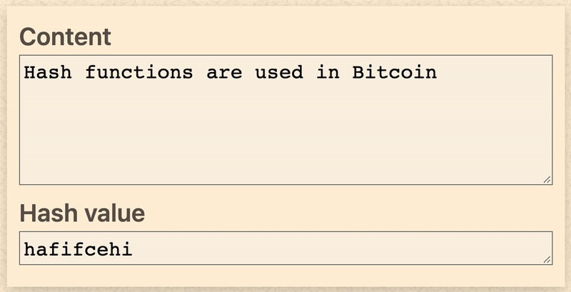

<!--
<link rel="icon" href="https://quipubank.com/wp-content/uploads/2022/10/logo-back.svg" sizes="32x32" />
<link rel="icon" href="https://quipubank.com/wp-content/uploads/2022/10/logo-back.svg" sizes="192x192" />
-->

<style>
@import url(https://fonts.googleapis.com/css?family=Google+Sans);

:root {
    font-family: "Google Sans";
    --color-background: #ddd;
    --color-background-code: #ccc;
    --color-background-paginate: rgba(
        128, 128, 128, 0.05
    );
    --color-foreground: #345;
    --color-highlight: #99c;
    --color-highlight-hover: #aaf;
    --color-highlight-heading: #99c;
    --color-header: #bbb;
    --color-header-shadow: transparent;
    img[alt~="center"] {
        display: block;
        margin: 0 auto;
    }
}

section::after {
  content: attr(data-marpit-pagination) '/' attr(data-marpit-pagination-total);
}
</style>


# Blockchain, Web3 y DeFi
<br>

# QuipuBank

---
# Blockchain, Web3 y DeFi

- **Blockchain:** Conceptos, historia y Smart Contracts.
- **Web3:** Blockchain + Web2, Interactuar con la Blockchain.
- **Finanzas Decentralizadas:** DeFi, AMM y Lending Pools, Quipu.

---
# Blockchain
- Conceptos fundamentales y técnicos.
- Historia.
- Smart Contracts.

---
## Blockchain / Conceptos Fundamentales

- Registro público
- Distribuido y decentralizado
- Inmutable y anónimo
- Consultar es gratis
- Se paga por escribir

<!--
- **Registro contable público distribuido y decentralizado**
- **Anónimo:** La participación en cada transacción es referenciada a **números de cuenta**.
- **Consultar es gratis.**
- **Se paga por escribir:** Esfuerzo computacional = _gas transaction_
(internet standar se paga a los keepers de los data werehouse) (internet standar se paga a los keepers de los data werehouse)
- **Inmutable:** Habilita la trazabilidad de las transacciones.
-->

---
<style scoped>
section{ background-image:none !important} 
</style>

### Blockchain / Conceptos técnicos / Hash

<!--
Metodo criptográfico para codificar datos en una cadena de caracteres única.

Lo básico que ocurre en la criptografía:
Tienes una entrada (un número, una palabra, una cadena de texto),
y aplicas alguna función sobre ella,
y produce un número o palabra diferente o lo que sea como salida.

Asegurar autenticidad de datos, contraseñas, firmar documentos electrónicos.

La función puede ser el cifrado César (desplazar cada letra de una palabra en uno o más
puntos del alfabeto, por lo que "César" se convierte en "Dbftbs"), o el latín
porcino (desplazar las primeras consonantes de la palabra al final y añadir
"-ay", por lo que "César" se convierte en "Aesar-say"), o algo más
complicado.

(El ejemplo clásico es que multiplicar dos
números primos grandes es bastante sencillo; factorizar un número enorme en dos
primos grandes es difícil). El cifrado César es fácil de aplicar y fácil de
invertir, pero algunas formas de codificación son fáciles de aplicar y mucho
más difíciles de invertir. Eso las hace mejores para los códigos secretos.

Una propiedad útil en una función criptográfica es que sea "unidireccional".
Esto significa que es fácil convertir la cadena de entrada en la de salida,
pero difícil hacerlo a la inversa; es fácil calcular la función en una
dirección pero imposible en la otra.
-->

---
<style scoped>
section{ background-image:none !important} 
</style>

### Blockchain / Conceptos técnicos / Hash

<!---
Un ejemplo de esto es una función "hashing", que toma un texto de entrada y lo
convierte en un número largo de un tamaño fijo.

Podría enviarte el número y decir:

"He escrito un artículo y lo he pasado por un algoritmo de
hashing SHA-256, y este número es el resultado".

Tendrías el número, pero no serías capaz de entenderlo.
En concreto, no podrías introducirlo en un programa
informático y descodificarlo, convirtiendo el hash en este artículo.
-->

---
### Blockchain / Conceptos técnicos / Cadena de bloques
<style scoped>
section{ background-image:none !important} 
img {
  margin:auto;
  text-align: center;
}
p {
  margin:auto;
  text-align: center;
}
</style>


- Información agrupada en bloques.
- Metadata relativa (hash) de otro bloque anterior en la cadena.

<!--
- Seguimiento seguro a través de hashes.
-->

---

### Blockchain / Conceptos técnicos / Cadena de bloques decentralizada
- **Libro de contabilidad decentralizado**.
- **Nodos:** Ordenadores independientes.
- ~~Mantener los datos centralizados~~.
- **Base de datos pública no relacional de un histórico irrefutable**.

<!--
- Blockchain es un tipo de **libro de contabilidad decentralizado**.
- Utiliza ordenadores independientes (**nodos**)
   para **registrar, compartir y sincronizar transacciones** en sus respectivos libros digitales;
- ~~Mantener los datos centralizados~~ (como en un libro de finanzas tradicional)
- Ejerce de **base de datos pública no relacional de un histórico irrefutable** de información.
-->

---
<style scoped>
img {
  margin:auto;
  text-align: center;
}
p {
  margin:auto;
  text-align: center;
}
</style>
### Blockchain / Conceptos técnicos / Blockchain


---
<style scoped>
img {
  margin:auto;
  text-align: center;
}
p {
  margin:auto;
  text-align: center;
}
</style>


---
<style scoped>
p{
  font-size: 28px;
}
</style>

# Smart Contracts
- Piezas de código que se alojan y ejecutan en la Blockchain.
- Especifican **condiciones** predeterminadas que, cuando se cumplen, **desencadenan resultados**.
- Resultado **compartido, preciso, oportuno y a prueba de manipulaciones**. 

<!--
Los contratos inteligentes son **programas informáticos que se alojan y ejecutan en la Blockchain**.
Consiste en código que especifica **condiciones** predeterminadas que, cuando se cumplen, **desencadenan resultados**.
Al ejecutarse en una cadena de bloques descentralizada, permiten que varias partes lleguen a un **resultado compartido de forma precisa, oportuna y a prueba de manipulaciones**. 
-->

---


## ¡Hola Mundo! 
- Ejemplo de un Smart Contract que actualiza una cadena de texto.
- Compatible con Ethereum.

---

### Blockchain / Samatr Contract / Cryptoactivos
Tipos especiales de Smart Contracts para representar:
- Tokens
- Non Fungible Tokens (NFT)
- Real World Assets (RWA)
- Sould Bound Tokens (SBT)

<!--
fungible = consumo
-->


---
<style scoped>
section{ background-image:none !important} 
</style>

# Web3
 - Blockchain + Web2
   - on-chain data
   - off-chain data
 - Interactuar con la Blockchain
   - Wallets
   - Eventos

---

### Web3 / Blockchain + Web2 = Web3
- **Leer y generar datos _on-chain_**
  (información dentro de la Blockchain:
  balances, cuentas, transferencias)
  desde el **navegador** y aplicaciones.
- **Consultar flujos de datos _off-chain_**
  (información del mundo real:
  clima, precios, trafico, etc)
  desde la **blockchain** mediante Smart Contracts.

<!--
- Término creado por el cofundador de Ethereum, Gavin Wood, en su artículo _Insights Into a Modern world_.
La diferencia fundamental con Web2 en donde reciden los datos y quien los "cuida".
-->


---

## Web3 / Interactuar / Wallets de criptomonedas

- Piezas clave para interactuar con la Blockchain.
- Experiencias tempranas de dApp (interfaces Web3).
- Como _add-on_ de navegador, la mas usada es _Metamask_ pero hay muchas otras.

---
## Web3 / Eventos  / Emitir 

```
// Declare an Event
event Deposit(address indexed _from, bytes32 indexed _id, uint _value);

// Emit an event
emit Deposit(msg.sender, _id, msg.value);
```
Método especial de los Smart Contract que exponen información a partir de determinadas condiciones cumplidas.

---
<style scoped>
h1,h2,h3, p{
color: #FFF;
}

</style>


## Web3 / Eventos / Escuchar

Tools,
librerías, SDKs y servicios 
se subscriben
a Smart Contracts
y registran Eventos
emitidos.

---


# DeFi: Finanzas Decentralizadas

Principales arquetipos:
- Creadores Automáticos de Mercado (AMM / Liquidty Pools).
- Pools de Préstamos (Lending Pools) 

<!--
---
## DeFi / Tokens 
-->

---

**DeFi / Automated Market Makers (AMM)**
- Permiten a intercambiar unidades de diferentes tipos de criptoactivos.
- Sin necesidad de encontrar una contraparte.

---

**DeFi / Lending Pools**
- Permiten a usuarios que no son de confianza mutua:
  **Prestar y tomar prestados**
  Criptoactivos.
- Con o sin colaterales.

<!--
Los pools de préstamos son apps descentralizadas que
- Permiten a usuarios que no son de confianza mutua:
  - Prestar criptoactivos.
  - Tomar prestados criptoactivos.
-->


---
<style scoped>
h3, p{
margin-top:-50px;
}

</style>

### Quipu /<br>Lending Pool 
<!--
Acceder a lineas de credito sin establecer un elemento de valor como garantía es que el puede confiscar
al prestatario si éste no devuelve el préstamo según las condiciones acordadas.

Un ejemplo común es cuando se contrata una hipoteca.
Normalmente, el banco le
pedirá que aporte su casa como garantía. 
-->

---

## Quipu / Lending Pool / Protocolo de Smart Contracs 
Sistema de Contratos que gestiona:
- Flujo crédito que proviene de cualquier persona del mundo.
- Fondo de liquidez de donde extraer activos.

<!---
de forma rápida y a tipos de interés asequibles
1. Quipu planea que los
microcréditos provengan de cualquier persona del mundo,
creando un nuevo fondo de liquidez del que se puede extraer.
de forma rápida y a tipos de interés asequibles;

Y aquí es donde entran los tokens.
Los prestamistas compran un token, que está vinculado al peso colombiano para que los microempresarios
puedan obtener dinero real de forma rápida y a tipos de interés asequibles;
y a cambio los inversores reciben un token que genera intereses y
que aumenta su valor a medida que se devuelven los préstamos. 

2. Los préstamos se asignan desde el fondo común a los usuarios de Quipu incluidos en la lista blanca,
basándose en la puntuación crediticia de Quipu.
Quipu construye una puntuación crediticia de IA utilizando información del comportamiento digital de los usuarios en la app,
ventas, puntuación de los clientes, sociodemográfica, etc.

3. Los microempresarios son recompensados con tokens cuando devuelven sus préstamos a tiempo, traen más prestatarios a la comunida
 tienen un catálogo actualizado, etc. Con esos tokens
pueden comprar productos a otros comerciantes de la plataforma, devolver sus préstamos,
ahorrar o incluso realizar inversiones en otros emprendedores de la plataforma Quipu. 
l objetivo final es que estos poseedores de tokens se conviertan en
una herramienta de gobernanza descentralizada en el futuro.
Los emprendedores de Quipu que posean tokens de gobernanza ganarán poder de decisión sobre el protocolo de préstamos.

4. Los prestatarios recibirán su dinero en una tarjeta de prepago que podrán utilizar
para gastar en determinados negocios, mientras reciben tokens quipu como devolución de dinero.
No necesitarán cambiar cripto por moneda fiduciaria.
-->

---

### Quipu / Lending Pool / Secuencias
- Supply
- Borrow
- Repay
- Withdraw
---

### Quipu / Lending Pool / Default 
- Supply
- Borrow
- Default 
- Withdraw

---
<style scoped>
code {
  background: transparent;
  color: #000;
  font-weight: bold;
  min-width: 80%;
}
</style>

# ¡Muchas Gracias!

```
                        ________  ___  ___  ___  ________  ___  ___     
                       |\   __  \|\  \|\  \|\  \|\   __  \|\  \|\  \    
                       \ \  \|\  \ \  \\\  \ \  \ \  \|\  \ \  \\\  \   
                        \ \  \\\  \ \  \\\  \ \  \ \   ____\ \  \\\  \  
                         \ \  \\\  \ \  \\\  \ \  \ \  \___|\ \  \\\  \ 
                          \ \_____  \ \_______\ \__\ \__\    \ \_______\
                           \|___| \__\|_______|\|__|\|__|     \|_______|
                                 \|__|                                  
                        ________  ________  ________   ___  __       
                       |\   __  \|\   __  \|\   ___  \|\  \|\  \     
                       \ \  \|\ /\ \  \|\  \ \  \\ \  \ \  \/  /|_   
                        \ \   __  \ \   __  \ \  \\ \  \ \   ___  \  
                         \ \  \|\  \ \  \ \  \ \  \\ \  \ \  \\ \  \ 
                          \ \_______\ \__\ \__\ \__\\ \__\ \__\\ \__\
                           \|_______|\|__|\|__|\|__| \|__|\|__| \|__|
```
## ¿Preguntas?

---
# Referencias

http://Blockchain.mit.edu/how-Blockchain-works
https://www.cbsnews.com/news/web3-cryptocurrency-nft-tim-oreilly/
https://es.wikipedia.org/wiki/Cadena_de_bloques
https://chain.link/education/smart-contracts
https://www.coinbureau.com/review/the-graph-grt/
https://clarusway.com/what-is-a-web3-wallet
https://medium.com/coinmonks/the-current-state-of-undercollateralized-defi-lending-2021-1f84e14527b5


